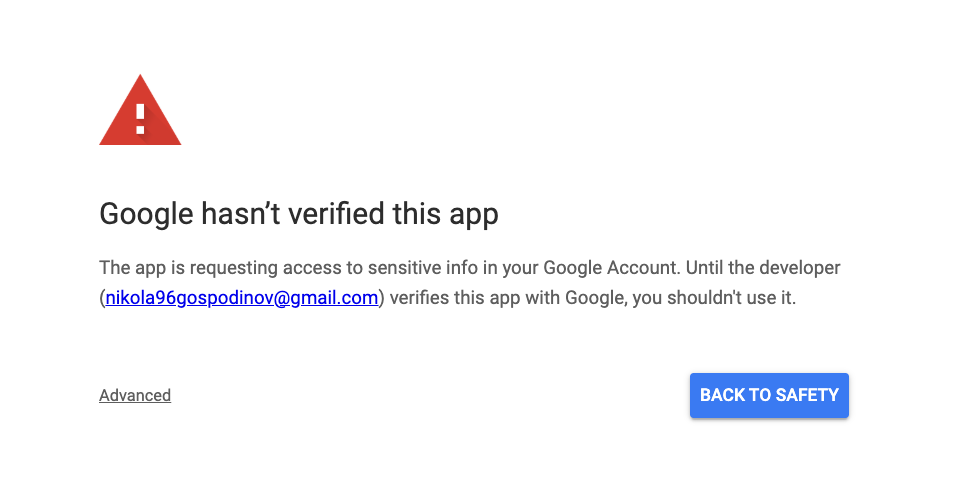
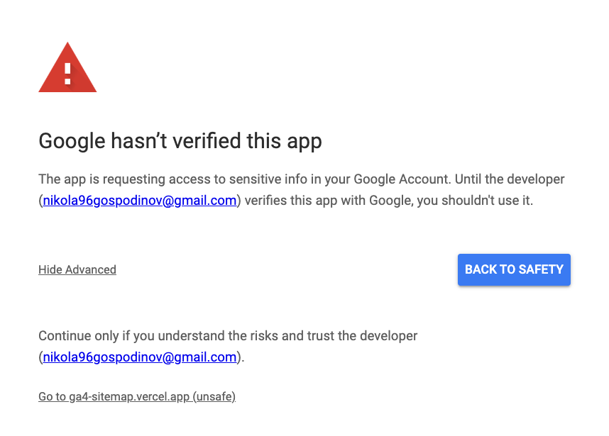
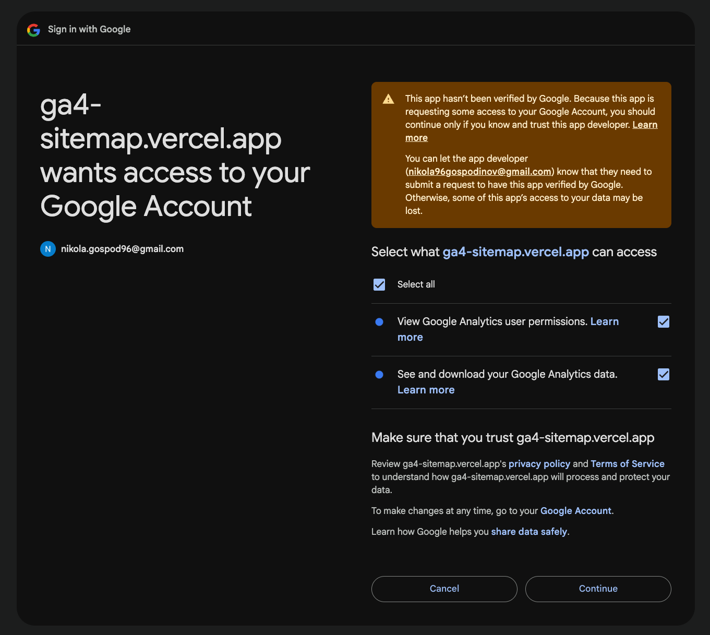

# GA4 Sitemap Clustering

Live URL: [On Vercel](https://ga4-sitemap.vercel.app/)

Production demo: [Loom](https://www.loom.com/share/e2168e69ee924ebcb53eea9b8329fa04?sid=fc882139-a700-4280-86c9-8249d1938a41)

Local demo: [Loom](https://www.loom.com/share/9842cbf77e284cfbb0da46280241be7e?sid=0f03136b-6d37-469d-86f7-4dbcf5a65c03)

## In case the app is not approved by Google by the time you're reading this

Once you click on "Sign in with Google", you'll get the following screen:



Click on "Advanced" at the bottom left corner. A new section will appear:



Click on "Go to ga4-sitemap.vercel.app (unsafe)"

You should be allowed to sign in with Google now.

After selecting an account and accepting the basic permissions you will be asked to accept permissions that allow the app to access your Google Analytics data:



Click on "Select all" and click on "Continue"

You should be signed in now.

# Project setup

You'll need the following environment variables:

- AUTH_SECRET (random set of characters)
- GOOGLE_CLIENT_ID (from Google Cloud Console - see below)
- GOOGLE_CLIENT_SECRET (from Google Cloud Console - see below)

## Google Cloud Console Setup

1. Go to the [Google Cloud Console](https://console.cloud.google.com/)
2. Create a new project (or use an existing one)
3. Head to the [OAuth Overview](https://console.cloud.google.com/auth/overview)
4. Click on "Get started"
5. Fill in the form with the following:
   - App name: "GA4 Sitemap Clustering"
   - User support email: _your email_
   - Audience: "External"
   - Contact information: _your email_
   - Agree to the terms of service
6. Click on "Create"
7. Head to [Audience](https://console.cloud.google.com/auth/audience)
8. Click on "Add users" and add the email with which you'll be testing the app
9. Head to the [OAuth Credentials](https://console.cloud.google.com/apis/credentials)
10. Click on "Create credentials"
11. Select "OAuth client ID"
12. Select "Web application"
13. Fill in the form with the following:
    - Application name: "GA4 Sitemap Clustering"
    - Authorized JavaScript origins:
      - For local development: "http://localhost:3000"
      - For production: _your domain_
    - Authorized redirect URIs:
      - For local development: "http://localhost:3000/api/auth/callback/google"
      - For production: _your domain_/api/auth/callback/google
14. Enable [Google Analytics Data API](https://console.cloud.google.com/marketplace/product/google/analyticsdata.googleapis.com)
15. Enable [Google Analytics Admin API](https://console.cloud.google.com/marketplace/product/google/analyticsadmin.googleapis.com)

# Running the project

```bash
npm run dev
```
